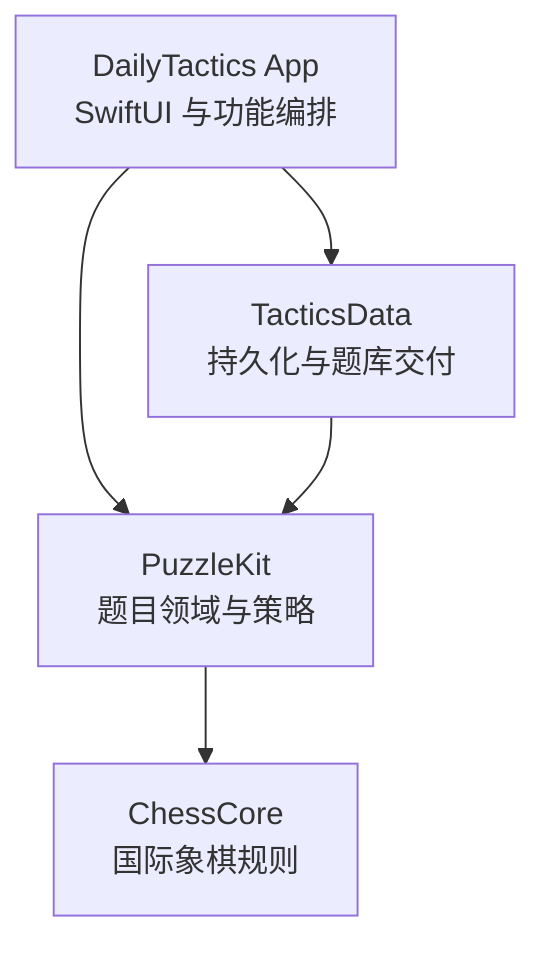
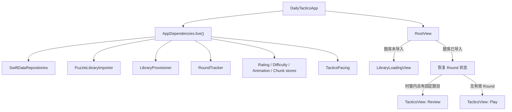
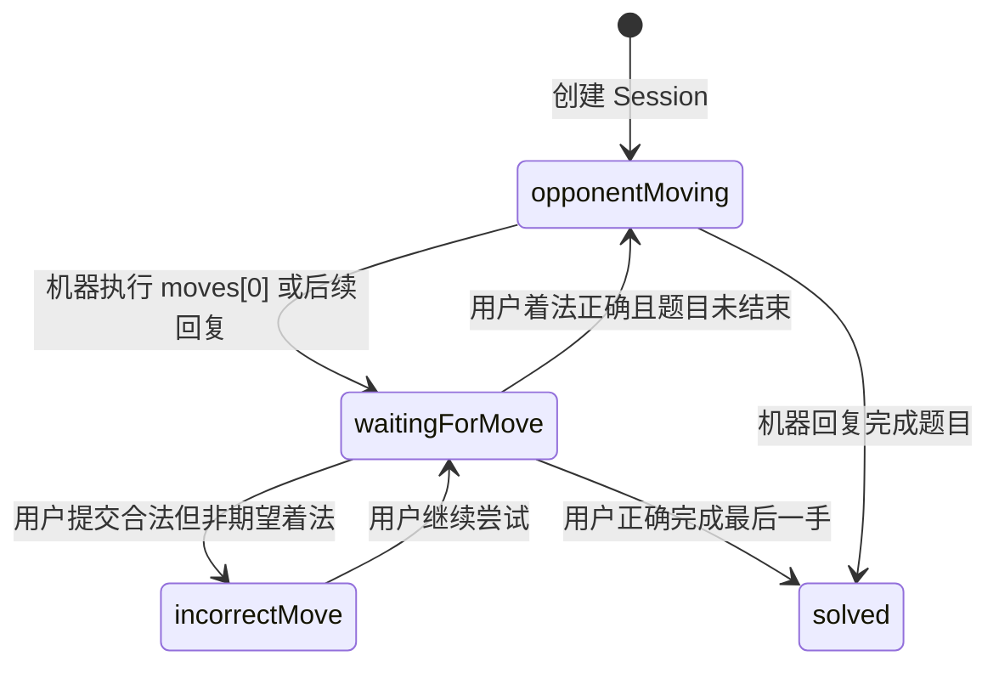
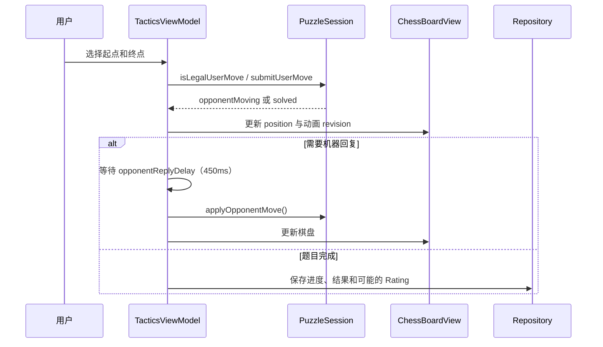
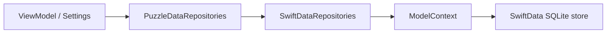
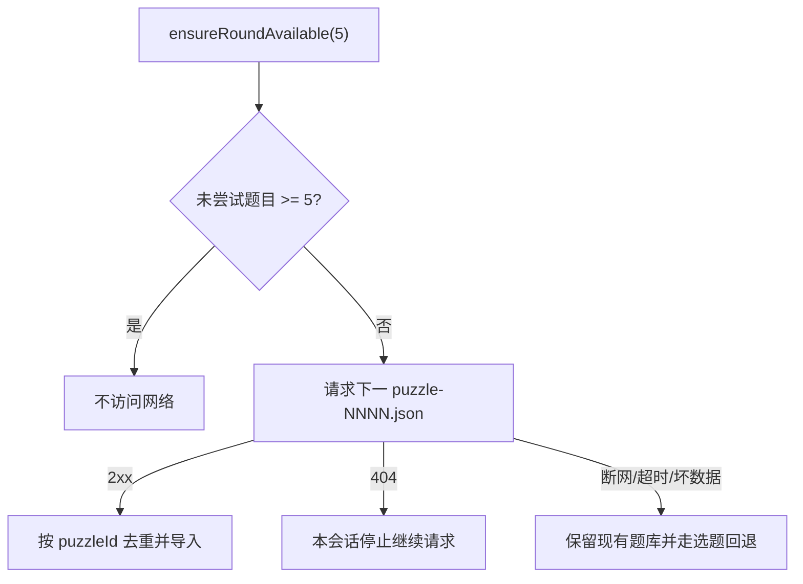
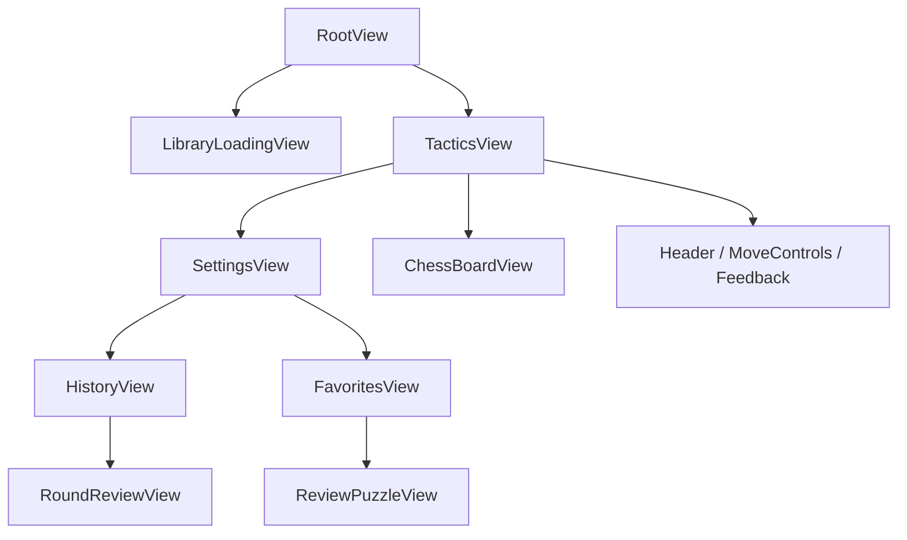

# DailyTactics iOS 架构说明

本文从代码架构和工程结构角度说明 DailyTactics iOS 客户端如何实现产品能力，供产品设计、开发、测试和后续维护共同参考。

产品规则以 [`../BUSINESS_LOGIC.md`](../BUSINESS_LOGIC.md) 为准；本文关注模块职责、依赖方向、运行时装配、状态流转和数据存储。当前 Android 工程暂停开发，不属于本文范围。

## 1. 技术边界

- 平台：iOS 17+
- UI：SwiftUI
- 语言与并发：Swift 6、Swift Concurrency
- 本地数据库：SwiftData
- 轻量配置：UserDefaults
- 工程生成：Tuist 4.197.3
- 测试：XCTest
- App Bundle ID：`com.dienbell.tactics`

工程定义的唯一来源是 `ios/Project.swift` 和 `ios/Tuist.swift`。`DailyTactics.xcodeproj` 是生成物，不应直接编辑。

## 2. 总体架构

项目采用按职责拆分的四目标架构。依赖方向单向且无环：



| Target | 职责 | 可以依赖 | 不应包含 |
|---|---|---|---|
| `ChessCore` | 棋盘、棋子、FEN、UCI、走法应用与合法性 | Foundation | SwiftUI、SwiftData、产品流程 |
| `PuzzleKit` | Puzzle、解题状态机、Rating/难度/Round 策略、Repository 协议 | `ChessCore` | UI、数据库实现、网络实现 |
| `TacticsData` | SwiftData、UserDefaults、内置题库导入、远端分块下载 | `PuzzleKit` | SwiftUI 页面、训练交互状态 |
| `DailyTactics` | App 入口、依赖装配、SwiftUI Features、ViewModel、交互节奏 | `PuzzleKit`、`TacticsData` | 底层棋规重复实现、直接 SQL |

这种分层使棋规和业务策略可独立测试，同时让存储技术可以通过 Repository 边界替换。

## 3. 目录结构

```text
ios/
├── Project.swift                     Tuist 项目、Target 和 Scheme 定义
├── Tuist.swift                       Tuist 配置
├── ChessCore/
│   ├── Sources/
│   │   ├── Pieces.swift              棋子、颜色、着法等值类型
│   │   ├── Square.swift              棋盘坐标与 UCI 方格
│   │   ├── Board.swift               FEN 建盘与走法应用
│   │   └── BoardRules.swift          完整合法性规则
│   └── Tests/                        棋规单元测试
├── PuzzleKit/
│   ├── Sources/
│   │   ├── Puzzle.swift              题目领域模型与主题
│   │   ├── PuzzleSession.swift       单题状态机与复盘推进
│   │   ├── RatingPolicy.swift        Rating 计算策略
│   │   ├── DifficultyMode.swift      难度模式
│   │   ├── RoundPolicy.swift         Round 数量、时窗和查找规则
│   │   ├── RoundSelector.swift       选题策略
│   │   ├── PuzzleOutcome.swift       单题结果
│   │   └── Repositories.swift        数据与交付端口
│   └── Tests/                        状态机和策略测试
├── TacticsData/
│   ├── Sources/
│   │   ├── Models/                   四个 SwiftData Model
│   │   ├── SwiftDataRepositories.swift
│   │   ├── UserDefaultsStores.swift
│   │   ├── BundledPuzzleSource.swift
│   │   ├── PuzzleLibraryImporter.swift
│   │   ├── RemotePuzzleSource.swift
│   │   └── LibraryProvisioner.swift
│   ├── Resources/Puzzles/            App 内置 puzzle-0000.json
│   └── Tests/                        Repository、导入和下载测试
└── DailyTactics/
    ├── Sources/
    │   ├── DailyTacticsApp.swift     App 与根路由
    │   ├── AppDependencies.swift     Composition Root
    │   ├── RoundTracker.swift        Round 时窗观察器
    │   ├── TacticsPacing.swift       UI 交互时间参数
    │   └── Features/
    │       ├── Onboarding/           首次题库导入
    │       ├── Tactics/              训练、棋盘、反馈和复盘
    │       └── Settings/             设置、历史、收藏和趋势图
    ├── Resources/                    素材、本地化、隐私与许可证
    └── Tests/                        App 层 ViewModel 与协调逻辑测试
```

## 4. App 启动与依赖装配

`DailyTacticsApp` 只创建一次 `AppDependencies.live()`，再通过 SwiftUI Environment 向下传递。Feature 不自行创建数据库或读取全局单例。



`AppDependencies` 有两套装配：

- `live()`：磁盘 SwiftData、标准 UserDefaults、真实网络 Fetcher。
- `preview()`：内存 SwiftData、隔离 UserDefaults、无网络 Fetcher。

这使 Preview 和测试不污染真实用户数据。

## 5. 核心领域层

### 5.1 ChessCore

`ChessCore` 是最底层的纯棋规模块：

- 从 FEN 构造棋盘和轮到哪方行棋。
- 解析与表达 UCI 着法。
- 应用普通移动、吃子、王车易位、吃过路兵和升变。
- 验证棋子走法、将军、钉住和王车易位等合法性。

它不知道“题目”“Rating”“页面”或“数据库”，因此棋规可以独立复用和测试。

### 5.2 PuzzleKit

`PuzzleSession` 是单题核心状态机：



Lichess 解法数组采用机器先走：

- `moves[0]`：机器 setup move。
- `moves[1]`：用户第一手。
- 后续机器与用户交替。

`PuzzleSession` 负责棋局真相，包括当前棋盘、期望着法、当前索引和状态；它不负责动画时间、页面反馈、持久化或 Rating 写入。

同一模块中的策略对象包括：

- `RoundSelector`：优先从未尝试题目中按难度选题，不足时回退。
- `RoundPolicy`：每 Round 5 题；Debug 时窗 5 分钟，Release 时窗 8 小时。
- `PuzzleRatingCalculator`：独立计算 Rating delta。
- Repository protocols：定义领域层需要的数据能力，不暴露 SwiftData Model。

## 6. 训练 Feature

### 6.1 View 与 ViewModel 分工

`TacticsView` 负责布局、导航和将用户操作转发给 `TacticsViewModel`。棋盘由 `ChessBoardView` 独立渲染。

`TacticsViewModel` 使用扩展按职责拆分：

| 文件 | 职责 |
|---|---|
| `TacticsViewModel.swift` | 主状态、棋盘派生值、选中与翻转 |
| `TacticsViewModel+Session.swift` | 用户落子、错着演示、机器回复、加载题目 |
| `TacticsViewModel+Rating.swift` | Hint、结果、Rating、历史和复盘步进 |
| `TacticsViewModel+Round.swift` | 下一题、Review 循环、新 Round |

ViewModel 标记为 `@MainActor` 和 `@Observable`。所有会驱动 SwiftUI 的状态都在主 Actor 上更新。

### 6.2 正确着法路径



`opponentReplyDelay` 从用户着法提交后开始计算，生产默认值为 450ms，并非立即回复。

### 6.3 错误着法路径

只有合法但不符合题目解法的着法才进入错着演示：

1. `PuzzleSession` 转为 `incorrectMove`，真实棋盘不提交该着法。
2. `displayedPosition` 生成临时预览位置。
3. 棋子滑到错误目标格，停留 `wrongMoveDisplay`（默认 550ms）。
4. `snapbackMove` 驱动棋子滑回原格。
5. 用户可以重新尝试。

非法着法不会进入 Puzzle 状态机，也不会记录为错误结果。

### 6.4 Hint

Hint 是两阶段行为：

- 第一次点击：高亮期望着法，并立即按失败结算一次。
- 第二次点击：代用户执行期望着法，不重复扣分。

Hint 只通过 ViewModel 编排，`PuzzleSession` 不包含 Hint 概念。

### 6.5 Round 与 Review

- 创建 Round 时固定题目 ID 和顺序，并写入 UserDefaults。
- Round 中途不会重新选题。
- 完成当前题后，由用户点击 Next puzzle；等待 `nextPuzzleDelay`（默认 300ms）再加载下一题。
- Play Round 最后一题完成后，Next puzzle 将模式切换为 Review，并循环当前 Round。
- Review 可以操作题目和写进度，但 `canUpdateRating` 为 `false`。
- Review 中手动前后步进通过重放解法重建棋盘，不触发机器自动回复。

## 7. 棋盘与动画架构

`ChessBoardView` 将棋盘拆为两个图层：

- Square layer：格子颜色、高亮、坐标、点击区域。
- Piece layer：棋子图片、位置、transition 和动画。

棋子移动由 `BoardAnimation` 输入统一描述：

| 字段 | 作用 |
|---|---|
| `arrival` | 目标格到来源格的映射，描述本次棋子从哪里来 |
| `movesEnabled` | 是否启用移动动画 |
| `setupEnabled` | 是否启用新棋盘淡入 |
| `boardGeneration` | 新题代号，隔离前后两题的棋子 View identity |
| `moveRevision` | 每次移动/预览/回退的单调递增事务标识 |

`TacticsViewModel.displayedPosition` 负责错误着法的临时展示；`animatedArrival` 负责派生正常走棋、错着预览、自动回退和王车易位的来源映射。

动画属于展示层。`ChessCore` 和 `PuzzleKit` 不保存动画状态或等待时间。系统开启 Reduce Motion 时，棋子位置直接更新。

## 8. 数据层

### 8.1 Repository 边界

`PuzzleKit/Repositories.swift` 定义端口，`SwiftDataRepositories` 是当前适配器：



对上层公开的是 `Puzzle`、`RoundSummary`、`RatingSample` 等领域值，不是 SwiftData 持久化对象。

### 8.2 SwiftData Models

| Model | 内容 | 生命周期 |
|---|---|---|
| `PuzzleRecord` | FEN、moves、rating、themes 等静态题目数据 | 内置/远端导入时写入 |
| `PuzzleProgress` | attempted、completed、failed、favorite 与时间戳 | 用户交互时更新 |
| `RoundHistory` | 一轮的题目 ID 顺序和结果 | 每个完成 Round 恰好一条 |
| `RatingSnapshot` | Round 完成后的 Rating | 每个完成 Round 一条 |

`ModelContainerFactory.makeShared()` 注册四个 Model，并创建磁盘容器。Preview 和测试使用 `makeInMemory()`。

### 8.3 UserDefaults

适合标量、开关和当前 Round 身份的数据保存在 UserDefaults：

| Key | 数据 |
|---|---|
| `dailytactics.userRating` | 当前 Rating，默认 1500 |
| `dailytactics.difficultyMode` | 新 Round 难度 |
| `dailytactics.roundStartTime` | 当前 Round 开始时间 |
| `dailytactics.activeRoundPuzzleIDs` | 当前 Round 固定题目顺序 |
| `dailytactics.puzzleSequence` | 已导入的最高题库块编号 |
| `dailytactics.libraryImported` | 首次导入 gate |
| `dailytactics.pieceAnimation` | Debug 移动动画开关 |
| `dailytactics.setupAnimation` | Debug 载入动画开关 |

当前 Rating 的权威值是 UserDefaults 标量；`RatingSnapshot` 只用于趋势历史。

## 9. 题库交付与离线策略

App 内置一个 `puzzle-0000.json`，首次启动时导入 SwiftData。后续只在未尝试题目不足一个 Round 时访问网络：



关键原则：

- App 的核心训练功能离线可用。
- 下载失败不阻塞进入训练。
- 远端块按序号推进并在本地记住最高序号。
- `PuzzleRecord.puzzleId` 唯一，导入操作可重试。
- App 不包含账号、云同步、分析或其他后台网络业务。

## 10. Rating 和结果写入

Rating 更新由 App 层编排，计算公式在 `PuzzleKit/RatingPolicy.swift` 隔离：

- 首次干净答对：按成功更新 Rating。
- 首次走错：立即按失败更新 Rating；之后答对不再按成功加分。
- 使用 Hint：立即按失败扣分，重复 Hint 不叠加。
- 已尝试题目和 Review：不更新 Rating。
- Rating 限制在 `400...3000`。

单题结果采用 first-write-wins：一旦记录为 wrong，后续完成不能覆盖成 correct。`RoundHistory` 在最后一题完成时独立且只写一次；最终 `RatingSnapshot` 会在该题 Rating 结算后写入。

## 11. 时间与并发

产品交互时间统一放在 `TacticsPacing`：

| 参数 | 默认值 | 用途 |
|---|---:|---|
| `nextPuzzleDelay` | 300ms | 点击 Next puzzle 后再加载下一题 |
| `wrongMoveDisplay` | 550ms | 错着在目标格停留的时间 |
| `opponentReplyDelay` | 450ms | 用户正确着法提交后到机器回复 |

这些延迟只影响展示节奏，不参与领域正确性。测试可以注入 1ms 或定制值。

其他并发约束：

- UI、ViewModel、Repository 和 ModelContext 操作位于 MainActor。
- 内置 JSON 的读取与解码在 detached task 中执行，SwiftData 插入回到 MainActor。
- `RoundTracker` 只在到期点安排一个 Task，不使用轮询 Timer。
- 网络下载使用 async/await；失败转换为 `ProvisionOutcome`，不穿透到训练 UI。

## 12. Feature 页面关系



所有用户可见字符串统一维护在英语与简体中文资源中。棋盘格和控制项的 Accessibility Label 也必须本地化。

## 13. 测试结构

测试按模块职责分布：

- `ChessCore/Tests`：棋规、FEN、合法性与特殊着法。
- `PuzzleKit/Tests`：PuzzleSession、RoundSelector、Rating 等纯业务规则。
- `TacticsData/Tests`：SwiftData Repository、幂等导入、远端块交付与存储。
- `DailyTactics/Tests`：ViewModel 流程、RoundTracker、历史分组和时间相关协调。

时间依赖通过 `TacticsPacing` 或可注入时钟缩短/控制；持久化测试使用内存 ModelContainer 或隔离的 UserDefaults suite。

标准验证命令：

```bash
cd ios
mise x tuist@4.197.3 -- tuist generate
xcrun xcodebuild test \
  -project DailyTactics.xcodeproj \
  -scheme DailyTactics \
  -destination 'platform=iOS Simulator,name=iPhone 16 Pro'
```

UI 改动还应编译一个小屏 iOS Simulator destination，确保 iPhone SE 在正常 Dynamic Type 下无需滚动即可完成训练。

## 14. 修改代码时如何选择模块

| 需求 | 首选位置 |
|---|---|
| 新增或修复棋规 | `ChessCore` |
| 修改解题状态、选题或 Rating 算法 | `PuzzleKit` |
| 修改 SwiftData、UserDefaults、导入或下载 | `TacticsData` |
| 修改页面、交互反馈、动画或导航 | `DailyTactics` |
| 新增跨 Feature 依赖 | 先在 `AppDependencies` 装配，通过协议向下传递 |

新增能力时应保持以下不变量：

1. 依赖只能沿现有方向向下。
2. SwiftData Model 不穿过 Repository 边界进入领域层。
3. 动画和等待时间不进入 `PuzzleSession`。
4. Review 不修改 Rating，也不触发机器自动回复。
5. 当前 Round 的题目顺序在 Round 内保持固定。
6. 新增用户文案同时提供英语和简体中文。
7. 修改 `ios/Project.swift` 后重新生成工程，不手改 `.xcodeproj`。

## 15. 相关文档

- [`../BUSINESS_LOGIC.md`](../BUSINESS_LOGIC.md)：产品与业务规则
- [`../FEN_FORMAT.md`](../FEN_FORMAT.md)：FEN 格式
- [`../UCI_MOVE_NOTATION.md`](../UCI_MOVE_NOTATION.md)：UCI 着法格式
- [`../LICHESS_PUZZLE_THEMES.md`](../LICHESS_PUZZLE_THEMES.md)：题目主题
- [`../SIMULATOR_SWIFTDATA_SQLITE.md`](../SIMULATOR_SWIFTDATA_SQLITE.md)：Simulator 数据库调试
